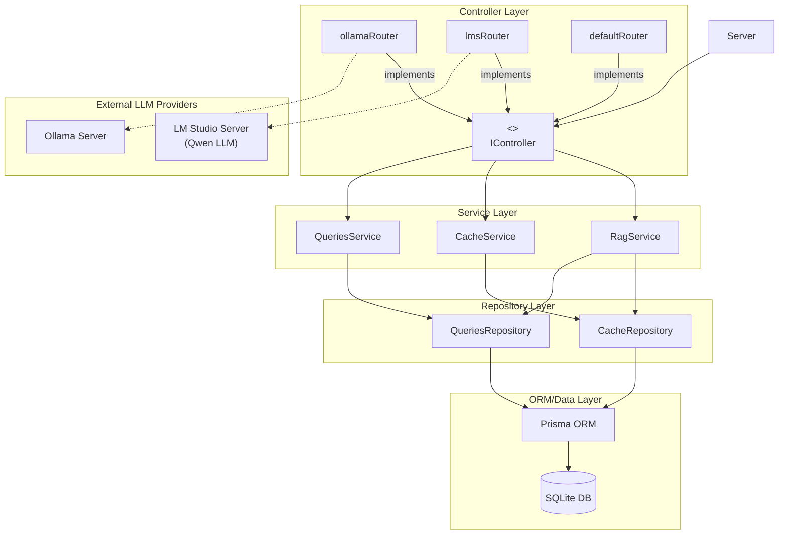

# Agentic Server

A backend server built with modern Node.js, TypeScript, and Prisma ORM. 
It serves as agentic server for https://ihorlazarkov.githun.io/ihorlazarkov 

## Tech Stack
- **Language**: TypeScript
- **ORM**: Prisma
- **Testing**: Node:Test, Node:Assert
- **Formatter**: Prettier
- **Testing**: Jest
- **CI/CD**: GitHub Actions

## Structure
The server follows a **Layered Architecture** (refer to `architecture_decision.md` for details). Dependencies flow from the outer layers (Controllers) to the inner layers (ORM).

### Architecture Diagram



### Folder Map
- `src/controllers/`: Handles HTTP requests and input validation (using Valibot).
- `src/services/`: Contains core business logic and orchestrates data flow.
- `src/repositories/`: Abstracts database operations and provides a clean interface for data access.
- `src/orm/`: Prisma client configuration and database schema.
- `src/tests/`: Automated unit and integration tests.

## Testing Strategy
Our testing approach mirrors the layered architecture to ensure each component behaves correctly in isolation and when integrated.

| Test Category | Architectural Layer | Responsibility | Tooling |
| :--- | :--- | :--- | :--- |
| **Unit** | Repositories | Database CRUD operations and Prisma query logic. | Node:Test, Assert |
| **Unit** | Services | Core business logic, prompt orchestration, and RAG processing. | Node:Test, Assert |
| **Integration** | Controllers | API routing, Valibot schema validation, and status code verification. | Node:Test |
| **System** | Full Application | End-to-end flow from Client HTTP request to Local LLM (LM Studio) response. | Node:Test |

## Running the Server

### Development
```bash
npm run dev
```

### Testing
```bash
npm test
```

### Running Server
```bash
npm run start:qa
```
or 
```bash
npm run start:prod
```
